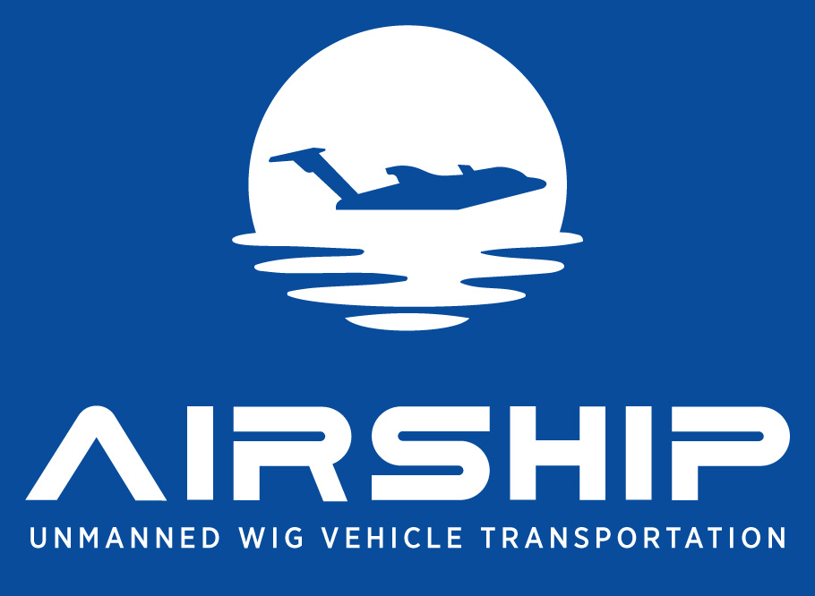
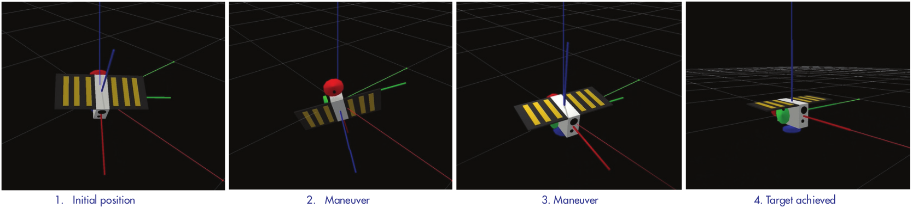

## About Me

Hello! I'm Matteo, a passionate PhD Researcher at the University of Luxembourg and a Machine Learning Engineer. 

My current research focus is on improving Reinforcement Learning algorithms (RL) in the context of autonomous complex robotic systems.

I have a Master in Computer Science and Engineering (AI track) from [Politecnico di Milano](https://www.polimi.it/en/international-prospective-students/laurea-magistrale-programmes-equivalent-to-master-of-science/programme-catalogue/computer-science-and-engineering), and a double BS degree from PoliMi and [Tongji University](https://en.tongji.edu.cn/p/#/).

While building strong foundations in Machine Learning, complex systems dynamics, and related subjects through formal education, I like to pursue my interest in human behavior and psychology by reading and learning about social dynamics, individual and collective intelligence. My drive is to build and understand AI technologies to explore the high-complexity landscape of decision-making, in ways that are novel to humans and potentially beneficial to tackling [humanity most pressing world problems](https://80000hours.org/problem-profiles/).
Here's how you can restructure the "Research & Projects" section of your GitHub.io page to match the style shown in the screenshot:

---

## Research & Projects

### AIRSHIP Project

As part of an EC-funded consortium, I'm working on the development of autonomous Guidance, Navigation, and Control (GNC) strategies for the innovative Unmanned WIG Vehicle (UWV). This involves:

- Simulation and implementation of GNC strategies.
- Deployment of RL-based policies to autonomously maneuver UWV, focusing on enhancing speed, flexibility, and energy efficiency.

For more information, check out [airship-project](https://airshipproject.eu/).

### Autonomous Systems for Space and Terrestrial Robotics

#### Reinforcement Learning for Underactuated Satellite Attitude Control

Developing RL-based attitude controllers for nanosatellites.

#### DRIFT: Deep Reinforcement Learning for Intelligent Floating Platforms Trajectories
<iframe width="560" height="315" src="https://www.youtube.com/embed/DgYw743_6VI?si=_4T7YsI8EhEQpZlM" frameborder="0" allow="accelerometer; autoplay; clipboard-write; encrypted-media; gyroscope; picture-in-picture" allowfullscreen></iframe>

Autonomous floating platforms using Deep Reinforcement Learning to perform high precision position and orientation control under dynamic and uncertain disturbances.

## Publications

- ["DRIFT: Deep Reinforcement Learning for Intelligent Floating Platforms Trajectories"](https://arxiv.org/abs/2310.04266) -- **Matteo El-Hariry**, Antoine Richard, Vivek Muralidharan, Matthieu Geist, Miguel Olivares-Mendez -- MASSpace'24 (International Workshop on Autonomous Agents and Multi-Agent Systems for Space Applications)
- ["Highly-Parallelised Simulator for Reinforcement Learning based Autonomous Navigating Spacecrafts"](https://atpi.eventsair.com/astra2023/programme) -- **Matteo El-Hariry**, Antoine Richard, Miguel Olivares-Mendez -- 17th Symposium on Advanced Space Technologies in Robotics and Automation, 2023
- ["Mobility Strategy of Multi-Limbed Climbing Robots for Asteroid Exploration"](https://clawar.org/clawar23/proceedings/) -- Warley FR Ribeiro, Kentaro Uno, Masazumi Imai, Koki Murase, Barış Can Yalçın, **Matteo El Hariry**, Miguel A Olivares-Mendez, Kazuya Yoshida -- Climbing and Walking Robots Conference, 2023
- ["Deep Reinforcement Learning Policies for Underactuated Satellite Attitude Control"](https://www.dynsyslab.org/deployable-decision-making-in-embodied-systems/) -- **Matteo El Hariry**, Andrea Cini, Giacomo Mellone, Alessandro Balossino -- NeurIPS 2021 Workshop on Deployable Decision Making in Embodied Systems
- ["A Validation and Calibration Methodology for Autonomous Navigation of Small Satellites"](https://iafastro.directory/iac/paper/id/65082/summary/) -- Sarah Ciaglia, Nicolò Roberto Benigno, **Matteo El Hariry**, Pasquale Tricarico, Valentina Marchese, Niccolò Battezzati, Simone Simonetti -- IAC (International Astronautical Congress) 2021

## Connect With Me

I'm always open to collaborations, discussions, and opportunities to share insights into AI and robotics. Feel free to connect with me through:

  
  
  

